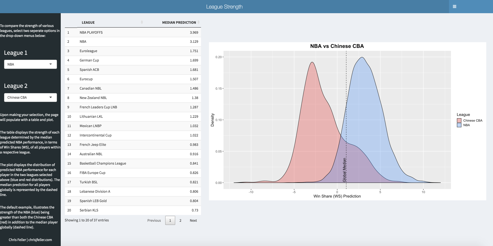
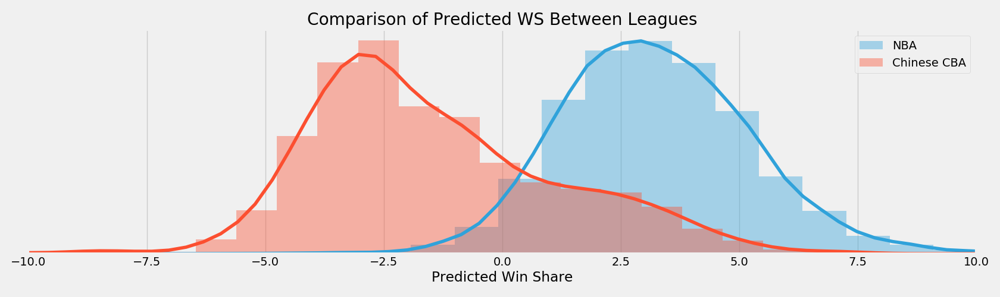
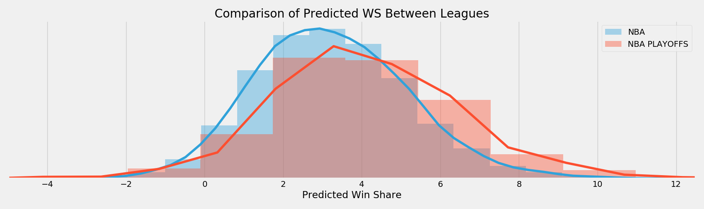
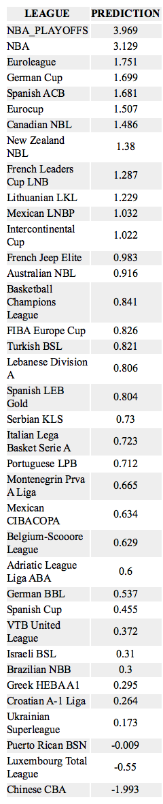

# League Strength

### Motivation
To effectively evaluate international prospects it is first useful to understand the relative strength of the leagues in which they participate. In an attempt to quantify the strength of each league throughout the world, I predicted the NBA performance of each international player over the last ten seasons. These predictions provide a distribution of the expected performance of a league had all of its players advanced to the NBA. By comparing the median prediction of each league's distribution, we gain a better understanding of which leagues are stronger than others.

The resulting league strength ranking provides a rank-ordered list of leagues, in addition to the magnitude of strength difference between respective leagues.

### Results
To view the league strength ranking and make comparisons between leagues, visit the following [interactive app](https://chrisfeller.shinyapps.io/prediction_app/), previewed by the screenshot below.

 
As a quick example, the following plot visualizes the difference in predicted NBA performance between the Chinese CBA (Red) and the NBA (Blue). If we were to take each player from both the CBA and NBA from the last 10 years and predict their performance into the NBA the following season we would expect to see these two distributions. This illustrates that the strength of the NBA is far greater than that of the CBA.

 
 

A second example below, compares the NBA to the NBA Playoffs. While the two are quite similar, we do see that the center of the NBA Playoff (Red) distribution is just to the right of the NBA regular season distribution (Blue) suggesting that on average the NBA Playoffs are stronger than the regular season.

 
The following table shows the full rank-ordered strength of each league in the data. Up to now we've shown that the NBA is stronger than the CBA and the playoffs are stronger than the regular season. We're now able to see the magnitude of those differences. By looking at the prediction column in the following table, we see that both the NBA and NBA Playoffs are significantly stronger leagues than the third-strongest, Euroleague. While the top of this table aligns with analyses done by others (see references), this ranking has the Adriatic and VTB United leagues ranked slightly lower. Alternatively, the Mexican league shows up much higher in the rankings than was expected.

 
 

As a proof-of-concept, this project directionally aligns with the findings of similar analyses and with a few improvements mentioned in the next-steps section at the bottom of the page, I expect those few leagues ranked slightly higher or lower to be adjusted.

### Data
Data for the project was scraped from [RealGM](https://basketball.realgm.com/international/league/1/Euroleague/stats/2019/Per_48/All/All/points/All/desc/1/Regular_Season?pace_adjustment=) and contains Per 48 Minute Pace-Adjusted box-score statistics between the 2009-2010 and 2018-2019 seasons for the 97 leagues in the website's database. In total, the data includes 32,671 distinct players making up 120,304 observations each with 25 features.

### Methodology

**Process**
1. Scraped Per 48 Minute Pace-Adjusted data for all players in RealGM's database between the 2009-2010 and 2018-2019 seasons.
    - Includes 97 leagues world-wide in addition to the NBA and NBA Playoffs
    - Includes all players (no qualification of playing time)
2. Scraped Miscellaneous Stats for NBA players between the 2009-2010 and 2018-2019 seasons to extract Win Shares (WS) statistic, which was used as the target variable in following player projection model.
    - The python file containing the scraping code can be found in the `/scraping` directory.
3. Joined Per 48 Minute Pace-Adjusted data for each player with their following season's NBA Win Shares.
    - Creates a dataframe containing international statistics of all players who made it into the NBA along with their subsequent NBA performance.
        - The dataframe includes the exact same information for each NBA player as well.
    - For example, Nikola Jokic' Per 48 statistics from both the Serbian and Adriatic leagues in 2015 are aligned with his Win Shares from his rookie NBA season in 2016. The model in essence, is using his 2015 international statistics to predict his 2016 NBA performance.

    | Player       | SEASON | LEAGUE                   | GP | MIN  | FGM  | FGA  | … | WS   |
    |--------------|--------|--------------------------|----|------|------|------|---|------|
    | Nikola Jokic | 2015   | Serbian KLS              | 14 | 27.8 | 10   | 17.7 | … | 6.6  |
    | Nikola Jokic | 2015   | Adriatic League Liga ABA | 24 | 30.5 | 8.8  | 17.4 | … | 6.6  |
    | Nikola Jokic | 2016   | NBA                      | 80 | 21.7 | 8.5  | 16.7 | … | 9.8  |
    | Nikola Jokic | 2017   | NBA                      | 73 | 27.9 | 11.4 | 19.7 | … | 10.7 |
    | Nikola Jokic | 2018   | NBA                      | 75 | 32.5 | 10   | 20   | … | 11.6 |

4. Utilizing the dataframe explained above, built a ridge regression model to predict the following season WS for each player based on their current season statistics.
    - The model contained all Per 48 Minute Pace Adjusted statistics as continuous inputs and the league name as a categorical input to the model.
    - Performed a 75/25 train/test split during the model-training step. The model recorded a RMSE of 2.52 when predicting on the test set. As a reference point the range of WS in the training data was -2.2 to 19.1.
    - The python file containing model training code can be found in the `/modeling` directory.
5. Deploying the trained model from the step above, predicted the season+1 NBA performance for all NBA and international players.
    - This provides a distribution of predicted performance for each league had its players all advanced to the NBA.
    - One of the problems I struggled to solve was how to handle players with low minutes or games played. Making predictions for players who played very little and have outlier statistics will ultimately lead to outlier predictions. As a solution, I ended up evaluating league strength by the median predicted WS for the league. This avoids the influence of most outlier predictions and thus allowed me to complete the model training and predictions without having to filter the input data set.
    - As an initial proof-of-concept and for the sake of time, I only made predictions for the 37 leagues that have had a player advance to the  NBA over the last 10 seasons.
6. Calculated the median predicted NBA performance (WS) for each league, which serves as a proxy for league strength.
    - The python file for the league strength calculation can be found in the `/output` directory.
7. Built R Shiny App to display output and allow users to interactively compare leagues
    - The R file for the shiny app can be found in the `/prediction_app` directory.

### Next Steps
As an initial proof-of-concept, I sought to deliver the project in a timely manner. With additional time, I'd look to implement the following next steps.

1. Apply a more advanced modeling approach such as mixed-effects or hierarchical model to better deal with league-structured data. Using the league as a categorical variable in the regularized regression is a good first pass at solving the problem but I expect more precise predictions with a model more catered to the structure of this data.
2. Use more than Per-48 Pace Adjusted data to model
    - With an expedited project I just needed a standardized dataset across leagues and this happened to be easiest. In reality I would have used per-100 possession data and advanced box score data in addition to player characteristic data such as height, age, etc.
3. Add all leagues
    - The subset of leagues came from RealGM and while it was an extensive list, 97 total leagues in addition to the NBA and NBA Playoffs, it wasn't comprehensive. With more time I would have added the Olympics, FIBA, Team USA Exhibitions, G-League, and the NCAA broken down by conference.
4. Use a more representative target variable. Any 'top-down' impact metric like WS has its drawbacks. I'd look to use something like RAPM or PIPM as a target variable that is more representative of a player's total impact.

### References
1. [Vashro, Layne. *Deep Dives: Measuring Level of Competition Around the World*](https://fansided.com/2015/11/06/deep-dives-measuring-level-of-competition-around-the-world/)
2. [Vashro, Layne. *Projecting International Players*](https://fansided.com/2014/08/13/projecting-international-prospects/)
